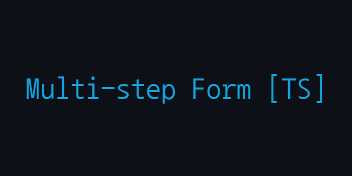
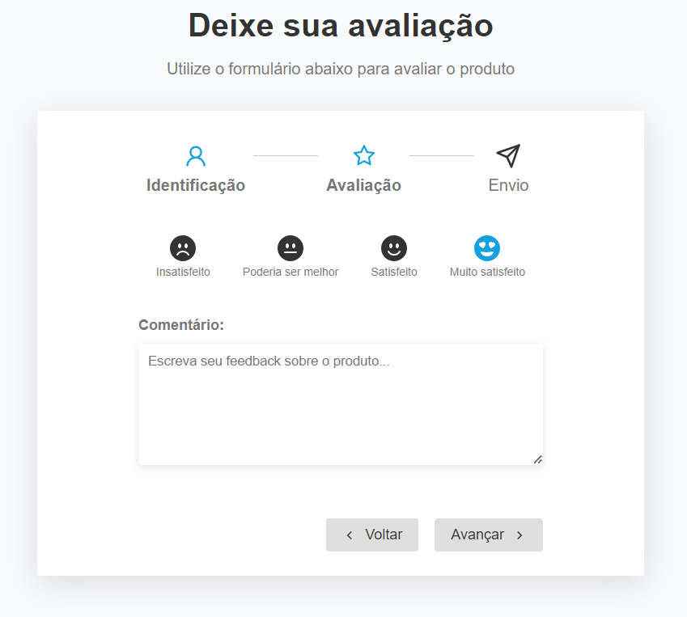

<p align="center">
  
</p>

## Overview

- This is project that implements a multi-step form for fictional product evaluation
- Built using React, Vite and TypeScript

<p align="center">
  
</p>

## Installation and Usage

To view this project locally, follow these steps:

1. Install [Node.js and NPM](https://nodejs.org/en/download/package-manager)
2. Clone the repository:
   ```bash
   git clone https://github.com/GiuliaFreulon/multistep-form-ts
   cd multistep-form-ts
   ```
3. Install the dependencies:
   ```bash
   npm install
   ```
4. Run the project:
   ```bash
   npm run dev
   ```
5. Open the localhost link that will appear in the terminal

## License

This project is licensed under the MIT License. See the [LICENSE](LICENSE) file for details.
